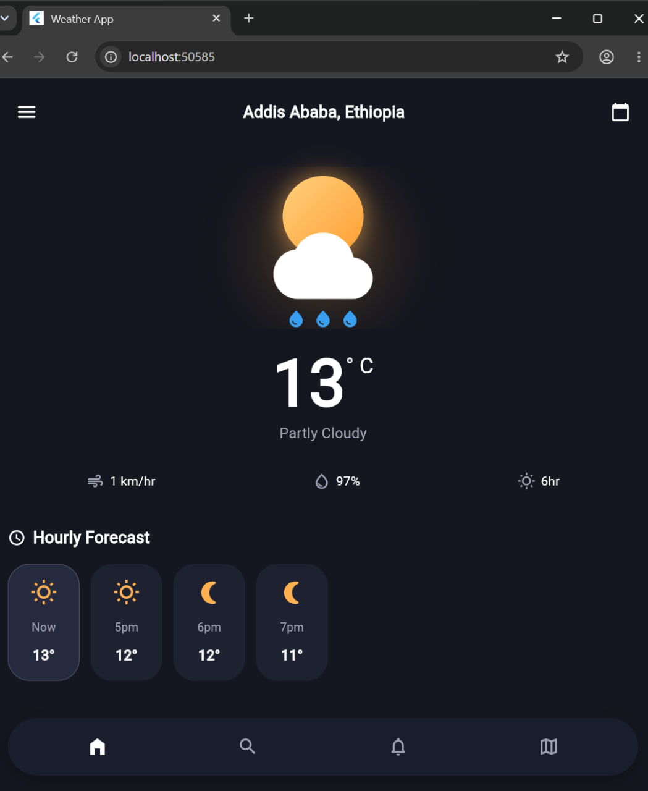

# Flutter Weather App

A fully functional, polished weather app built using Flutter and connected to the live **Open-Meteo API** for coordinates corresponding to Addis Ababa, Ethiopia.

## Features

- **Live Weather API Integration**: Fetches real-time temperature, wind speed, relative humidity, precipitation, and WMO weather codes without hardcoded current metrics.
- **Custom UI Styling**: Closely matches the dark gradient aesthetic, rounded cards, custom typography, glowing sun/cloud visual header, and sleek bottom navigation bar.
- **Clean Architecture**: Separates UI (`screens`, `widgets`), Network Services (`services`), Data Models (`models`), and Theme Constants (`utils`).
- **Resilient Network Handling**: Includes proper loading states, pull-to-refresh capabilities, and error handling with a retry button.

## Getting Started

1. Ensure you have the [Flutter SDK](https://docs.flutter.dev/get-started/install) installed (version 3.0.0 or higher).
2. Run `flutter pub get` in the root project directory to install dependencies (`http`).
3. Run `flutter run` to launch the application on your connected device or emulator.

# Preview

